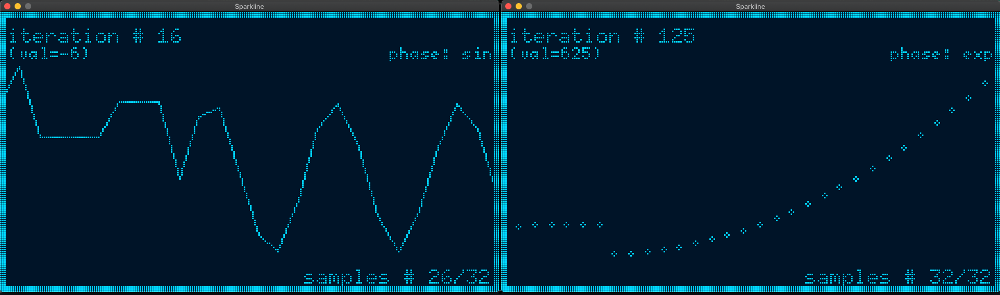

<div id="top"></div>

<!-- PROJECT SHIELDS -->
<!--
*** I'm using markdown "reference style" links for readability.
*** Reference links are enclosed in brackets [ ] instead of parentheses ( ).
*** See the bottom of this document for the declaration of the reference variables
*** for contributors-url, forks-url, etc. This is an optional, concise syntax you may use.
*** https://www.markdownguide.org/basic-syntax/#reference-style-links
-->
[![Contributors][contributors-shield]][contributors-url]
[![Forks][forks-shield]][forks-url]
[![Stargazers][stars-shield]][stars-url]
[![Issues][issues-shield]][issues-url]
[![Build Status][build-status]][build-status-url]
[![MIT License][license-shield]][license-url]
[![LinkedIn][linkedin-shield]][linkedin-url]


<!-- PROJECT LOGO -->
<br />
<div align="center">
  <a href="https://github.com/bernii/embedded-graphics-sparklines">
    
  </a>

<h3 align="center">Sparklines for Rust's Embedded-graphics</h3>

<div align="center">
  
</div>

  <p align="center">
    <a href="https://en.wikipedia.org/wiki/Sparkline">Sparklines</a> are small, high resolution graphics embedded in a context of words, numbers or images". Edward Tufte describes sparklines as "data-intense, design-simple, word-sized graphics".
    <br />
    <a href="https://github.com/bernii/embedded-graphics-sparklines"><strong>Explore the docs »</strong></a>
    <br />
    <br />
    <a href="https://crates.io/crates/embedded-graphics-sparklines">Rust Crate</a>
    ·
    <a href="https://github.com/bernii/embedded-graphics-sparklines/issues">Report Bug</a>
    ·
    <a href="https://github.com/bernii/embedded-graphics-sparklines/issues">Request Feature</a>
  </p>
</div>


<!-- TABLE OF CONTENTS -->
<details>
  <summary>Table of Contents</summary>
  <ol>
    <li>
      <a href="#about-the-project">About The Project</a>
      <ul>
        <li><a href="#built-with">Built With</a></li>
      </ul>
    </li>
    <li>
      <a href="#getting-started">Getting Started</a>
      <ul>
        <li><a href="#prerequisites">Prerequisites</a></li>
        <li><a href="#installation">Installation</a></li>
      </ul>
    </li>
    <li><a href="#Quickstart">Quickstart</a></li>
    <li><a href="#roadmap">Roadmap</a></li>
    <li><a href="#license">License</a></li>
    <li><a href="#contact">Contact</a></li>
    <li><a href="#acknowledgments">Acknowledgments</a></li>
  </ol>
</details>


<!-- ABOUT THE PROJECT -->
## About The Project

This library is a Rust implementation of [ESParklines](https://github.com/0xPIT/ESParklines) library which is extemely useful for creating real-time graphs for use with small embedded systems screeens.

This library is designed to be as simple as possible. It is responsible for:
- holding a buffer of pre-defined size of numeric data type
- renders sparklines using a passed-in function to draw lines
- is display-driver independent as you can provide any drawing function
- works with embedded-graphics simulator so you can quickly iterate on you dev machine

<p align="right">(<a href="#top">back to top</a>)</p>


### Built With

* [rust](https://www.rust-lang.org/)
* [embedded-graphics](https://github.com/embedded-graphics/embedded-graphics)
* [embedded-graphics-simulator](https://docs.rs/embedded-graphics-simulator/latest/embedded_graphics_simulator/)

<p align="right">(<a href="#top">back to top</a>)</p>


<!-- GETTING STARTED -->
## Getting Started

Make sure you have your `rust` environment configurated

### Installation

1. Add library to your `Cargo.toml`

    ```toml
    ...
    [dependencies]
    embedded-graphics-sparklines = "0.1.0"
    ```
2. Use the library in you code
    ```rust

    let mut display: SimulatorDisplay<BinaryColor> = SimulatorDisplay::new(Size::new(240, 135));
    let bbox = Rectangle::new(Point::new(0, 26), Size::new(240, 90));
    let draw_fn = |lastp, p| Line::new(lastp, p);

    // create sparkline object
    let mut sparkline = Sparkline::new(
        bbox, // position and size of the sparkline
        32,   // max samples to store in memory (and display on graph)
        BinaryColor::On,
        1, // stroke size
        draw_fn,
    );

    let output_settings = OutputSettingsBuilder::new()
        .theme(BinaryColorTheme::OledBlue)
        .build();
    let mut window = Window::new("Sparkline", &output_settings);

    loop {
      let val = rand::thread_rng().gen_range(0..100);
      sparkline.add(val);
      sparkline.draw(&mut display)?;

      window.update(&display);
      thread::sleep( Duration::from_millis(100);
    }
    ```
3. Experiment and have fun! :relieved: See `main.rs` if you want to run a quick demo. 

<p align="right">(<a href="#top">back to top</a>)</p>


<!-- USAGE EXAMPLES -->
## Quickstart

1. Make sure you've got `cargo` set up
2. Install cargo binary crate to be able to test easily on your computer
    ```bash
    $ cargo install embedded-graphics-sparklines
    ```
2. Run the provided binary example with simulator display
   ```bash
   $ embedded-graphics-sparklines --features build-binary
   ```
3. You should see an output similar to the followig one


<p align="right">(<a href="#top">back to top</a>)</p>


<!-- ROADMAP -->
## Roadmap

- [ ] add tests
- [ ] add rustdocs
- [ ] CI integration with GithHub Actions
- [ ] better error generation & handling

See the [open issues](https://github.com/bernii/embedded-graphics-sparklines/issues) for a full list of proposed features (and known issues).

<p align="right">(<a href="#top">back to top</a>)</p>


<!-- LICENSE -->
## License

Distributed under the MIT License. See `LICENSE` for more information.

<p align="right">(<a href="#top">back to top</a>)</p>


<!-- CONTACT -->
## Contact

Bernard Kobos - [@bkobos](https://twitter.com/bkobos) - bkobos@gmail.com

Project Link: [https://github.com/bernii/embedded-graphics-sparklines](https://github.com/bernii/embedded-graphics-sparklines)

<p align="right">(<a href="#top">back to top</a>)</p>


<!-- ACKNOWLEDGMENTS -->
## Acknowledgments

* ESParklines [project](https://github.com/0xPIT/ESParklines) which this is based on

<p align="right">(<a href="#top">back to top</a>)</p>


<!-- MARKDOWN LINKS & IMAGES -->
<!-- https://www.markdownguide.org/basic-syntax/#reference-style-links -->
[contributors-shield]: https://img.shields.io/github/contributors/bernii/embedded-graphics-sparklines.svg?style=for-the-badge
[contributors-url]: https://github.com/bernii/embedded-graphics-sparklines/graphs/contributors
[forks-shield]: https://img.shields.io/github/forks/bernii/embedded-graphics-sparklines.svg?style=for-the-badge
[forks-url]: https://github.com/bernii/embedded-graphics-sparklines/network/members
[stars-shield]: https://img.shields.io/github/stars/bernii/embedded-graphics-sparklines.svg?style=for-the-badge
[stars-url]: https://github.com/bernii/embedded-graphics-sparklines/stargazers
[issues-shield]: https://img.shields.io/github/issues/bernii/embedded-graphics-sparklines.svg?style=for-the-badge
[issues-url]: https://github.com/bernii/embedded-graphics-sparklines/issues
[license-shield]: https://img.shields.io/github/license/bernii/embedded-graphics-sparklines.svg?style=for-the-badge
[license-url]: https://github.com/bernii/embedded-graphics-sparklines/blob/master/LICENSE
[linkedin-shield]: https://img.shields.io/badge/-LinkedIn-black.svg?style=for-the-badge&logo=linkedin&colorB=555
[linkedin-url]: https://linkedin.com/in/bernii
[product-screenshot]: images/screenshot.png
[build-status]: https://img.shields.io/endpoint.svg?url=https%3A%2F%2Factions-badge.atrox.dev%2Fbernii%2Fembedded-graphics-sparklines%2Fbadge%3Fref%3Dmain&style=for-the-badge
[build-status-url]: https://actions-badge.atrox.dev/bernii/embedded-graphics-sparklines/goto?ref=main
